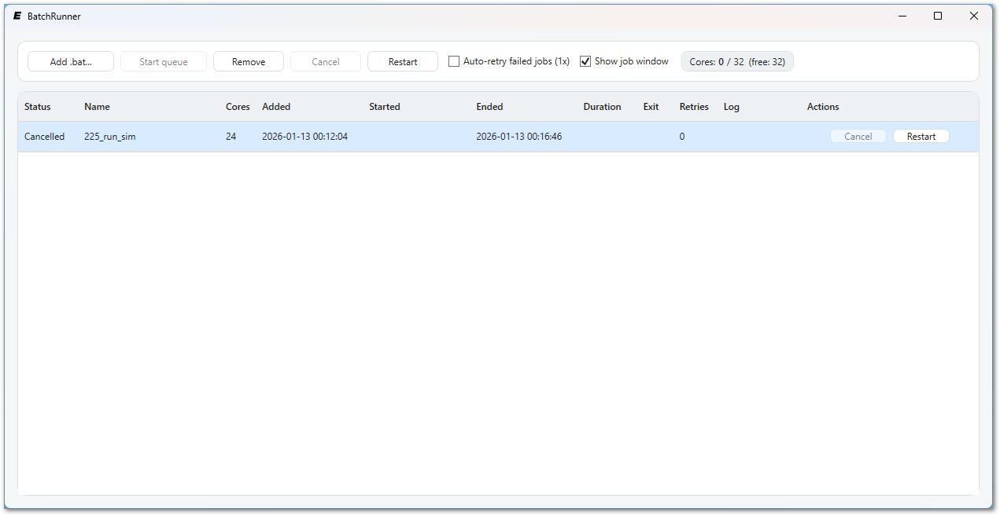

# Eddy3D-BatchRunner
[](https://github.com/Eddy3D-Dev/Eddy3D-BatchRunner/actions/workflows/build.yml)

BatchRunner is a lightweight, single-server Windows queue runner for `.bat`-driven CFD simulations. It detects core usage from `-np` flags, schedules FIFO execution up to the physical core limit, and persists the queue across restarts.



## Features
- WPF GUI with drag/drop add and drag/drop reordering
- FIFO queue with automatic scheduling based on required cores
- Per-job logging, timing, exit codes, and status tracking
- Auto-retry on failure (one retry when enabled)
- Queue persistence in a local JSON file next to the app

## How core usage is detected
- Each `.bat` file is scanned for `-np` flags (for example: `mpiexec -np 24`).
- The maximum `-np` value found is treated as the job's required cores.
- If no `-np` is found, the job defaults to 1 core.

## Files written next to the app
- `batchrunner_state.json`: persisted queue and settings
- `logs/`: per-job log files (one log per run)

## Build and run (developer)
```powershell
dotnet restore
dotnet run --project .\BatchRunner\BatchRunner.csproj
```

## Publish single EXE
```powershell
dotnet publish .\BatchRunner\BatchRunner.csproj -c Release
```

The single EXE will be in `BatchRunner\bin\Release\net8.0-windows\win-x64\publish`.

## Publish via script
```powershell
.\publish.bat
```

The publish output will be in `publish`.
